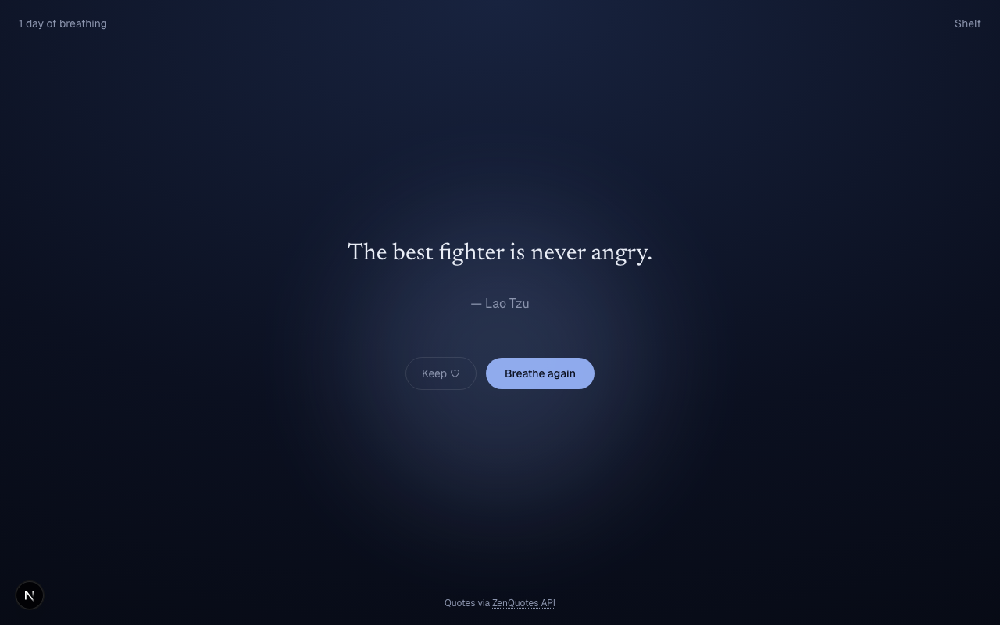

# Breathe — daily zen

A calm daily quote app built on the [ZenQuotes API](https://zenquotes.io/). Not a quote shuffler: today's shared quote fades in **line by line, paced to a breathing orb** (a real ~4s inhale / 6s exhale rhythm), so reading it becomes one slow breath instead of a text dump.

Day 24 of Savion's [100 Day AI Build Challenge](https://www.100dayaichallenge.com/share/savion).

## Features

- **Breathing reveal** — the quote unfolds one line at a time in sync with a softly pulsing orb, turning a quote into a ~15-second calm moment.
- **Quote of the day** — anchored on ZenQuotes' shared daily quote (resets midnight CST), the same for every visitor that day.
- **Breathe again** — pull another quote from a locally-rotated batch; no extra API calls, no hammering.
- **Keep a shelf** — save quotes that land for you to a personal shelf (stored locally in your browser).
- **Streak** — a quiet counter of consecutive days you've come back to breathe.
- **No account, no backend** — everything personal lives in `localStorage`; ZenQuotes is proxied server-side so the browser never calls it directly.

## Screenshot



## Install

```bash
git clone https://github.com/Still-InFrame/day-24-zenquotes.git
cd day-24-zenquotes
npm install
npm run dev
```

Then open [http://localhost:3000](http://localhost:3000). No API key or environment variables needed — the app runs entirely on ZenQuotes' keyless endpoints.

## Stack

Next.js 16 (App Router) · React 19 · TypeScript · Tailwind CSS v4 · deployed on Vercel.

Quotes provided by the [ZenQuotes API](https://zenquotes.io/).
